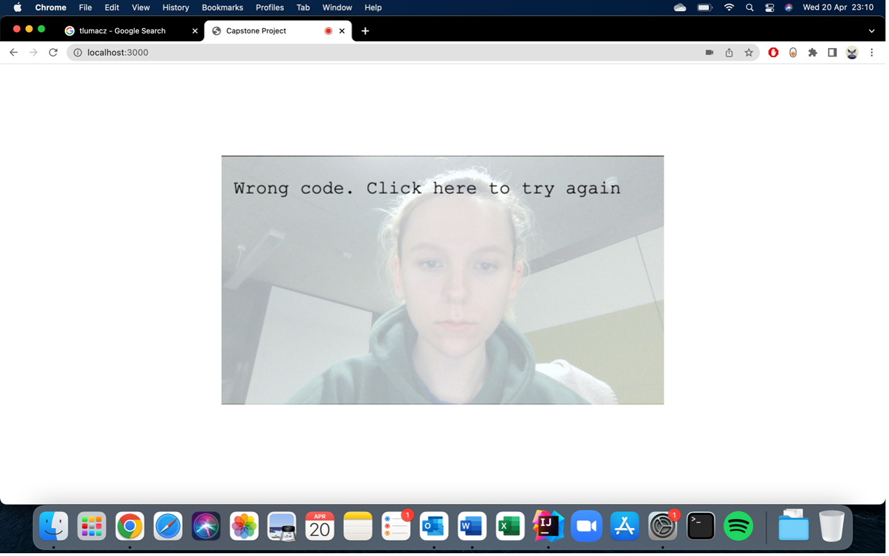
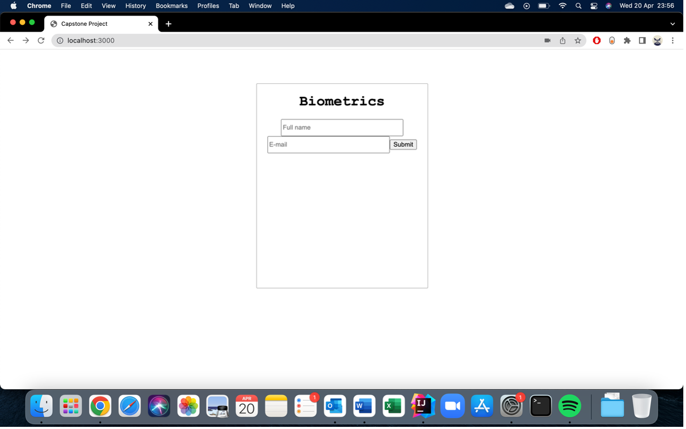
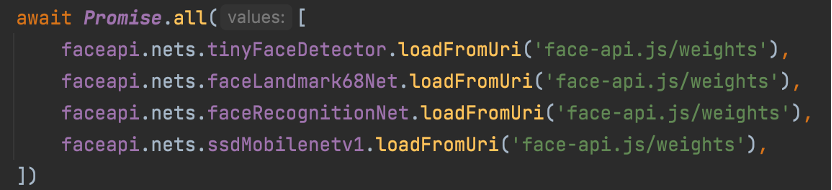

# Project Context

## Motivation & Role in the society
Nowadays, the Internet has become an even more dangerous place than it was a few 
years ago. The issue of network security is one of the biggest problems facing the 
world today. That is why people need new solutions more and more. 

The stored personal data on the network and access to it were, until recently, 
only protected by an email/username and password. However, with technological 
development, there is a need for new methods of protecting this data. Something 
unique, fast, simple, and not requiring reliance on human memory which can be 
unreliable. 

This is why the challenge was taken up to create such a solution.

## Problem
Full stack web creation and development where the users are identified using 
biometrics (facial recognition) rather than username and passwords, using web 
camera and face recognition system together with speech recognition and database 
storage.

### Entry requirements & expectations
1. System allows users to register, log in, delete personal data, change personal data, and log out.
2. System able to access web camera.
3. System able to carry on a facial recognition from a video from a live web camera.
4. System able to recognize users with as little error margin as possible.
5. System able to store data about users in the database.
6. System able to read data about users from a database.

### User stories
- New user > registration with biometric > system remembers their data
  - System opens web camera
  - Takes users’ face characteristics
  - Asks to enter their full name and email address
  - Save data to the database
  - Log in the user
- Registered user > log in > system authenticate them
  - System opens web camera 
  - Carry on face recognition with live stream video from the camera
  - Check if the database contains data of the user
  - If the user exists in the database, log in
  - If the user is not in the database, return a message
- Registered user > change personal information > keep data secure
- Authenticated user > log out
  - End the session
- Registered user > delete an account > data removed

## Literature review & Analyze
Detailed description of papers review was written in a document annexed in project 
‘Documents’ directory called ‘CapstoneProject2021notes.docx’. A brief summary with 
analyze is provided below.

Most of the information sources did not contain pure information on how to create 
a website with biometric identification, but after analysis several research papers 
and reviewed wide range of open-source tutorials (face recognition systems, voice 
recognition systems, biometric identification, storage data in database etc.) an 
idea was found and implemented.

Following criteria [1] have been tried to meet:

- ***Usability***: System shall be user friendly that any type of user shall learn to 
operate the system after a short training. The interface by which user interact 
should be easy to navigate throughout the system.
- ***Reliability***: System shall be reliable in its best capacity to detect face and 
recognize the person in it.
- ***Availability***: System availability is the time when the application must be 
available for use.
- ***Recovery***: The system shall be able to recover or heal up when an error occurs. 
If it does not heal, then it should at least display an error message.
- ***Performance***: System should be designed such that it does not need much time to 
load pages. Develop each Interface page to be fast loading. All images, 
graphics and multimedia should be optimized to the appropriate size and quality 
to ensure that they load within a few seconds.

## Biometric recognition
For the most optimal facial recognition system, the `face-api.js` was chosen 
which is developed by Vincent Mühler. Based on `TF.JS`, it provides a lot of 
out-of-box models and APIs for face recognition. It’s optimized for web environment 
and easy to use [5].  

To be authenticated, the user presents a biometric sample to the sensor. Features 
extracted from this sample constitute the query, which the system then compares to
the template of the claimed identity via a biometric matcher. The matcher returns 
a match score representing the degree of similarity between the template and the 
query. The system accepts the identity claim only if the match score is above a 
predefined threshold [5].

Basic pipeline for face recognition can be seen on Figure 1 [3]:

## Advantages & disadvantages

- No need to remember password, username or which email was used to register
- Works with the camera and microphone on any modern computing device
- Faster, simpler, and more secure than one-time passwords, which are compromised as soon as a fraudster compromises your email or your device
- Immune to social engineering; can’t be sold on the Dark Web
- Usable across communication channels
- Blocks common fraud vectors, like SIM swaps and device spoofing

Biometric recognition is a natural and more reliable mechanism for ensuring that 
only legitimate or authorized users can enter a facility, access a computer system, 
or cross international borders. Biometric systems also offer unique advantages 
such as deterrence against repudiation and the ability to detect whether an 
individual has multiple identity cards (for example, passports) under different 
names. Thus, biometric systems impart higher levels of security when appropriately 
integrated into applications requiring user authentication [5].

Two major vulnerabilities that specifically deserve attention in the context of 
biometric authentication are spoof attacks at the user interface and template 
database leakage [5].

A biometric system is vulnerable to denials of service (system doesn’t recognize 
a legitimate user) and intrusions (system incorrectly identifies an impostor as
an authorized user), which can be caused by both intrinsic limitations and 
adversary attacks [5].

## Legal
This product would be licensed under Copyright, Designs & Patent Act 1988, 
to cover all aspects of the product. This prevents the code from being copied 
without permission. 

All aspects of the Intellectual Property such as Copyright and Trademarks have 
been carefully considered to ensure any breaching rules or regulations have been 
broken.

### Use of web camera and microphone
The use of access to the user's camera or microphone takes place only after 
obtaining the permission for this access from the user.

### Face-api.js
The face recognition system face-api.js used in the program is distributed 
under the MIT license. 

*MIT License Copyright (c) 2018 Vincent Mühler*

*Permission is hereby granted, free of charge, to any person obtaining a copy 
of this software and associated documentation files (the "Software"), to deal 
in the Software without restriction, including without limitation the rights to 
use, copy, modify, merge, publish, distribute, sublicense, and/or sell copies of 
the Software, and to permit persons to whom the Software is furnished to do so, 
subject to the following conditions.*

*The above copyright notice and this permission notice shall be included in all 
copies or substantial portions of the Software.*

### Web Speech API
The speech recognition system Web Speech API is licensed under the Creative 
Commons Zero v1.0 Universal which allows to:

- Commercial use
- Modifications
- Distribution
- Private use

### Node.js and Express.js
Both licensed under the MIT License which gives permission to:

- Commercial use
- Modifications
- Distribution
- Private use

## Health & Safety Issues
It has been established there is little-to-no health risk associated with the product.

There are a little-to-no physical safety issues directly from the product. 

The product has been tested to check if potential system failures have an element 
of risk to user safety and none were found. 

Due to the fact the product uses access to the user's camera and microphone, also 
user's private data such as e-mail, name and, above all, unique data about 
user's facial characteristics there may occur several security problems, such 
as leak of confidential data. However, it should not happen due to the fact the 
program can only be used on a local server, and it is not connected to the 
Internet.

## Ethical Issues
This program was designed primarily for the commercial use of the end-users to 
recognize and authenticate.  To do this personal data and storage of this data 
are required.

Individuals could feel embarrassed when disclosing private information to others 
or to an information system. Individuals may feel like an object if they are 
identified just by a code or number. Moreover, providing information about the 
human body may be unappropriated for someone. Hence, such a situation may be 
affected through the own perception of body integrity and intimacy [4].

The collection of the user's personal data takes place only after obtaining their 
consent. It is important to understand personal data is needed, will be kept for 
the sole purpose of the recognition process, and will not be disseminated.

# AIMS & OBJECTIVES
The main objective of the project was the creation and development of a website 
where the-end users are identified using biometrics rather than username and password. Instead, users are authorized based on their facial characteristics. 

The system has been written mainly using `JavaScript` and `Node.js`. An open-source 
facial recognition system created by Vincent Mühler `face-api.js` has been used 
to perform the user face identification process.  An open-source speech recognition
system `Web Speech API` was also used in order to increase system security. 
Data about users and their biometrics are stored in a database. 

# TECHNICAL DOCUMENTATION

## Implemented technologies 
Technologies, libraries, and external source programs used in the project:

- **HTML**

Standard markup language for documents designed to be displayed in a web browser. 

- **JavaScript**

All the functional code was written using `JavaScript`, both for the back- and 
front- end. 

- **CSS**

Language used to style the HTML documents.

- **MySQL**

Open-source relational database management system. Used this technology to store 
user data.

- **Node.js**

Open-source, cross-platform, back-end `JavaScript` runtime environment. 

- **Express.js**

Back-end web application framework for `Node.js`, released as free and open-source 
software under the MIT License. It is designed for building web applications and APIs.

- **Body-parser**

It is a body parsing middleware. It parse incoming request bodies in a middleware 
before handlers, available under the `req.body` property.

- **Cookie-parser**

Parse Cookie header and populate `req.cookies` with an object keyed by the cookie 
names. Optionally may enable signed cookie support by passing a secret string, 
which assigns `req.secret` so it may be used by other middleware.

- **Express-session**

Creates a session middleware with given options.

- **Face-api.js**

`JavaScript` API for face detection and face recognition in the browser implemented 
on top of the `tensorflow.js` core API

- **Web Speech API**

The API enables to incorporate voice data into web apps.

## General description of the program operations
The program can be executed after starting both the `MYSQL` server and running 
the `node server.js` command in the `terminal`. 

The user should type in the browser the website address, which is:

<http://localhost:3000/>

The following main page should be shown.

The user can click on the text “Biometrics” – which will take them to the same 
start page.

The user can also click on the text “Try” – the text will disappear, and two 
possibilities will be shown.

If the users are registered, they can click on the “Sign in” text, which would 
take them to the login process. It will make the sign in/up window disappears. 
The website will ask the user for camera and microphone access if were not already 
allowed and open the web camera. The recognition process will not start just yet. 

Firstly, the text as shown below will appear on the video, asking the user to 
remove glasses, headgear, and hair from their face. Also, ask to try to look 
straight at the camera. 

After users click on the video the following text will appear. This is where 
the voice recognition process begins.

The system is now waiting for the user to say the four digits aloud. If the code 
is not correct, the following message will be shown.

Otherwise, the cover will disappear from the video and here the face recognition 
process will be carried out. It takes up to 5 seconds for the system to recognize 
the face from a video, check if the database contains data about this user and 
retrieve it.

If the recognition process was successful, the user is transferred to a new page.

If the recognition process was not successful, the user is transferred to a 
new page.

If the users are not registered yet, they can click on the “Sign up” text, which 
would take them to the registration process. It will make the sign in/up window 
disappears. The website will ask the user for camera and microphone access if 
not already allowed and open the web camera. The recognition process will not 
start yet. 

The text as shown below will appear on the video, asking the user to remove 
glasses, headgear, and hair from their face. Also, ask to try to look straight 
at the camera.

After users click on the video the face recognition process will begin. It takes 
up to 5 seconds for the system to recognize the face from a video. 

If the user is already registered and tries to sign up, the system, after the 
face recognition process, will show the following message on the screen.

The user can click on the video, and it will trigger the login process

Otherwise, after a successful collection of data process will stop, the video 
window will disappear, and the following form will appear.

It asks the user for their full name and email address. 

After pressing the submit button, the users’ data will be saved to the database 
and the user is transferred to a new page.

## Product pipeline and algorithm
This is a more detailed description of how the product works than presented 
in the previous section. The various stages of the system operation, all methods, 
processed data, and results will be described in detail here.

  The system was based on the core technologies of website development: HTML, 
`JavaScript`, and `CSS`. `Node.js` and `Express.js` were used to connect the project 
files to the local server. `MySQL` technology was also used to store, enter, and 
read users’ data.

Two external source programs (face and speech recognition) were adapted to the 
needs of this system and several solutions included in them were applied to my 
system. Any other parts of the implemented code were created entirely by my own. 

### Entry setup
Due to the fact the program is based mainly on `Node.js`, it must be installed on 
the computer in order to establish connection with the local server. As well as 
with the `MySQL` server. 

The system is ready for operation the moment a connection is established with the 
`MySQL` server and the local server. 

During the production process, the `MySQL` server was connected through an 
application that was on my private computer. It was enough to turn it on and the 
connection was established. 

If it comes to a local server, it should be enabled preferably via command line. 
Simply need to change direction to the place the project file is saved and type 
command `node server.js`. 

The output in command line should be:

`Local server is listening on port 3000`

`MySQL server connected!`

Now the product is connected to both servers and can be used.

To use the program user should type following `URL` in the browser:

<http://localhost:3000/>

Description of the program operations in the section 'General description of the program operations'.

### Solutions
This section describes in detail the program files, methods, and how do they 
work together.

#### **index.html**
Basic HTML file serving as the main page of the program.

It contains the page meta setup such as `charset`, `name`, `content`, and `HTTP-equiv`. 
The title of the main page was set to simply be “Capstone Project”. To embed a 
client-side script two tags were used, first to obtain the `script.js` file, and 
the other for the `face-api.js` API. 

The body of the file contains two elements to define sections, with ids `body` 
and `medias`. 

The `body` section contains one `heading` element with `EventListener` that on click 
executes the `move()` `JavaScript` method, one `anchor` with id `add` and also 
`EventListener` that on click executes the `addSignOption()` method, and also an empty 
section element with id `sign` created for the purpose of creating a 
login/registration window at a later stage of the program's work. 

The `medias` section is empty and is used for the `video` and `canvas` elements to 
be put on the page later on in the program workflow.

#### **script.js**
The file responsible for all front-end operations.

`addSignOption()`

Method removes the `TextNode` with text “Try” from the page and adds two new 
anchor elements and two `TextNode` elements to the page. 

Both "Sign in" and "Sign up" anchors contain EventListeners. When the user 
clicks on any of them, the above table will disappear, the `launchMedia()` method 
will be executed, and the registration or login process will begin.

`move()`

The method contains one line of code which causes the user to be taken to the 
home page. It was used in an `EventListener` for an heading element with text 
“Biometrics”. 

`launchMedia()`

At the beginning the method makes the body element of the page hidden from view. 
Then creates two new elements: `div` and `video` and appends `div` element with the 
video. Then gets an element `medias` from the page and appends it with the `div` video. 

To perform a video and audio capturing on the page, following code was used.

`stopMedia()`

Used to stop the tracks and stream of the video and audio. Also removes video 
tag from the page so it is no longer visible for the user. 

`createForm()`

The function creates a new `form` element on the page, with visible placeholders 
for `name`, `email` address and `button` submit. Form uses method `post` and action `app` 
to send the form data to the server. One hidden placeholder is also included in 
the form. Its  value contains data about user’s facial descriptor, obtained 
with a help of a method `getNewUser(video)`.

`signInCanvas()`

Method creates a `canvas` element on the video element on the page. It shows a 
text message that asks user to remove hair, glasses, and headgear from the face, 
and look straight to the camera. The canvas element contains `EventListener` that 
after clicking it removes `canvas` element and the process of speech recognition 
is triggered.

`signUpCanvas()`

Very similar to the method `signInCanvas()`. Method creates a `canvas` element on 
the video element on the page. It shows a text message that asks user to remove 
hair, glasses, and headgear from the face, and look straight to the camera. 
The canvas element also contains `EventListener` that after clicking on it 
removes `canvas` element and the `createForm()` method is executed.

`faceRecognition(input)`

Asynchronous method responsible for performing the face recognition process in 
login process. It loads relative modules from `face-api.js` directory and awaits 
for `getDescriptorsFromDatabase()` method to execute. After getting data from the 
method, it then performs the detection of a single face with `FaceLandmarks` and 
`FaceDescriptor` from the input video from web camera. When the data is collected, 
method uses `faceMatcher` with distance 0.45 on the descriptors of faces collected 
from a database, then searches for the best match between the face detected 
on the video and those collected from database. 

When the matching is completed, method creates a `form` element with `post` method, 
`welcome` action, and one hidden element with a value of a `bestMatch.label` that 
contains the `UserID` of the recognized user. This form is than submitted and 
the data of `UserID` is sent to the server to validate.

More detailed descriptions of face recognition process in 'Face recognition pipeline' section.

`getDescriptorsFromDatabase()`

Asynchronous method that transforms data of user descriptors collected from 
database and returns a new `faceapi.LabeledFaceDescriptors` with label mapped 
with descriptor value. 

Method awaits to fetch the data from a server and collects it in a form of 
`JSON` datatype, that contains `UserID`, `Name`, `Email` and `Biometrics` values. The 
loop was used to create an array of labels, which are `UserID`s. Then the labels 
are mapped accordingly with relative `Biometrics` values, that are transformed 
into a new `Float32Array` and pushed into a new array.

`getNewUser(video)`

Similar asynchronous method to `faceRecognition(input)`. It also loads relative 
modules from `face-api.js` directory and performs a single face detection on the 
video from a web camera together with `FaceLandmarks` and `FaceDescriptors`. After 
collecting this data, and checking if the user’s data is not already present in 
the database, method stops the video using `stopMedia()` and makes the body element 
of the page visible to the user. The method returns a face descriptor of the 
face detected from web camera video.

In case the user has already been registered (their data is in the database), 
the appropriate message is shown on the screen with help of `canvas` element. 
The shown canvas element contains an `EventListener` that after clicking on it 
will trigger the sign in process.

`textRecognition()`

Method responsible for performing the speech recognition process during login process. 

First of all, method creates a new grammar for the recognition process. It 
begins with creating a new array of strings of digits from zero to nine. Than 
creates a new `SpeechGrammarList()` object and appends it with the new grammar 
entries, each with weight 1. Then the following parameters are set for 
`SpeechRecognition()` object.

Secondly, the code that the user will need to say aloud is generated using method 
`generateCode()`. Then, `canvas` element is created, containing a short command what 
the user needs to do together with the code. After that the speech recognition 
process is started.

The `SpeechRecognition()` object was set to have two `EventListeners`: 

`.onresult => {}`

When the user say the code visible on the `canvas` element, the input is 
converted into a string and checked if the input from user is the same as 
the one generated by the system, using method `equals(a, b)`. If they are equal, 
the `codeCheck` variable is set to `true`.

`.onspeechend => {}`

When the user stop talking, the `canvas` element is removed. Method checks if 
the `codeCheck` variable is `true` (which mean that the code and user’s input are 
the same) and if so, the face recognition is performed. Otherwise, new `canvas` 
element is created on the video with message “Wrong code. Click here to try again”. 
The canvas has contains `EventListener` that after pressing removes a `canvas` element 
and executes the `signInCanvas()` method.

`equals(a, b)`

Method used in the process of speech recognition. It checks if the two values 
a and b are equal. Firstly, method checks if values are of equal length, if not, 
method return `false`. As both a and b values could only be numerical, method parse 
the values to integers and then checks if each entry equals each other. If yes, 
the `bool` variable arises by 1. 

At the end method checks if the bool value equals the length of one of the inputs. 
If so, `true` value is returned, `false` value otherwise.

`generateCode()`

Method used in the process of speech recognition, responsible for creating a code 
that the user needs to say in purpose to login. It creates four random numbers 
using `Math.floor(Math.random())` and returns the four-digit string. 

#### **server.js**
File responsible for every back-end operation of the program. 

The program required to install a few external node models:

- `express`
- `body-parser`
- `database_setup` – created by me
- `cookie-parser`
- `express-session`

Besides, it needs several values like the `session id`, time in which the session 
terminates, an array of values that would be parsed to or from the database and 
an empty string of MySQL query.

The `app.use()` function was used to:

- set up the middleware function to serve files from within a given root directory
- specify the type of parsing
- tell the app to use JSON datatype
- parse cookies attached to the client request
- set up a new session store with given options

The `app` method also uses `POST` and `GET` methods for routing and responding to 
client requests, such as:

- `POST` with path `“/app”` which inserts the data of the user’s name, email and 
facial descriptor obtained from the form on the front-end, together with randomly
generated ID, to the database. It also sets up the session id to be the 
new user’s ID and sends the welcome message with the user’s name.
- `GET` with path `“/ap”` that reads all data from a database and sends this data, 
transformed into JSON datatype, to the front-end.
- `POST` with path `”/welcome”` first checks if the request is not equal to “unknow”, 
which would mean the recognition process was unsuccessful. If not, the id 
collected from the request is used to read data from a database about the user 
with this id. This id is then set to be the session id and a welcome message 
with the user’s name is sent.
- `GET` with path `“/”` to set up a default session.
- `GET` with path `“/logout”` used to destroy the current session and redirect the 
user to the main page.

The `app` also makes a server `listen` on port `3000`.

#### **database_setup.js**
Short node model responsible for creation of the connection with MySQL database 
and establishing the connection. Connection is created with following parameters.

Then the connection is being established. If the connection was unsuccessful 
the error is returned. Otherwise, the message is returned to the console.

## Face recognition pipeline
API called **face-api.js** created by Vincent Mühler and implemented on top of 
the `tensorflow.js` core API has been adopted for the purpose of this project. 
The API allows for face recognition, measurement of face similarity, 
face expression recognition, face landmarks detection and real-time tracking. 
The program was downloaded as a `zip` file from [GitHub](https://github.com/justadudewhohacks/face-api.js). 

No changes were made to the acquired program itself. The methods and models that 
the API provides were used during the implementation process of my code.

Basic pipeline for face recognition which was found looks as follows.

### Face detection
For face detection, this project implements an `SSD` (Single Shot Multibox Detector) 
based on `MobileNetV1`. The neural net will compute the locations of each face in 
an image and will return the bounding boxes together with its probability for 
each face. This face detector is aiming towards obtaining high accuracy in 
detecting face bounding boxes instead of low inference time [6].

The face detection model has been trained on the `WIDERFACE` dataset [6].

The face detector has been trained on a custom dataset of ~14K images labeled 
with bounding boxes. Furthermore, the model has been trained to predict bounding 
boxes, which entirely cover facial feature points, thus it in general produces 
better results in combination with subsequent face landmark detection than 
`SSD Mobilenet V1`[6].

### Face alignment
This package implements a very lightweight and fast, yet accurate 68-point face 
landmark detector. Models employ the ideas of depthwise separable convolutions 
as well as densely connected blocks [6].

The models have been trained on a dataset of ~35k face images labeled with 68 face 
landmark points [6].

### Features extraction
For face recognition, a `ResNet-34` like architecture is implemented to compute a 
face descriptor (a feature vector with 128 values) from any given face image, 
which is used to describe the characteristics of a personas face [6].

### Face matching
You can determine the similarity of two arbitrary faces by comparing their 
face descriptors, for example by computing the euclidean distance or using 
any other classifier of your choice [6].

To perform face recognition, one can use faceapi.FaceMatcher to compare 
reference face descriptors to query face descriptors [6]. 

### Process
First of all, the following models needed to be loaded from the adapted API 
from the `face-api.js/weights` directory.

The process of single face detection with face alignment and feature extraction 
in the project has been concluded in a single line of code provided below. 

The method detects the face with the highest confidence score in the input video. 
It then predicts the 68 landmark points for the detected face. After computing 
both elements, it computes the face descriptor (vector with 128 values) for 
that face.

The constant variable face contains an array `<WithFaceDescriptor<WithFaceLandmarks<WithFaceDetection<{}>>>>`

The face matching process (recognition) was performed with the code below.

The new `FaceMatcher` is initialized with the reference data, in this case, 
face descriptors of registered users from the database and a maximum distance 
of 0.45. Then the best match is searched for among descriptors from the database 
to the descriptor of the detected face. 

### Used solutions
- `SSD Mobilenet V1`	
- `TinyFaceDetector`
- `FaceRecognitionNet`
- `FaceLandmarkNet`
- `detectSingleFace()`
- `withFaceLandmarks()`
- `withFaceDescriptor()`
- `FaceMatcher`
- `findBestMatch()`
- `LabeledFaceDescriptors()`
- `loadFromUri()`
- `descriptor`

## Speech recognition pipeline
The program called `Web Speech API` has been adopted for the purpose of this project.
The `Web Speech API` makes web apps able to handle voice data [7]. There are two 
components of the API, but only one of them was used in my project, it is 
SpeechRecognition. It is accessed via the `SpeechRecognition` interface, which 
provides the ability to recognize voice context from an audio input and respond 
appropriately [7].

No changes were made to the acquired program itself. The methods and models 
that the API provides were used during the implementation process of this project.

### Used solutions
- `SpeechRecognition`
- `SpeechGrammarList`
- `grammars`
- `continuous`
- `interimResults`
- `maxAlternatives`
- `SpeechRecognition.start()`
- `SpeechRecognition.stop()`
- `SpeechRecognition.onresult()`
- `SpeechRecognition.onspeechend()`

## Product testing
The product testing was not really planned. Rather, I focused on testing 
every next element of the code immediately after implementing so it could 
work as was desired. Of course, it was not without complications. Some of the 
adapted software methods were difficult to combine harmoniously.

The problem that arose during the tests was when the database contained biometric 
data of a dozen or so people, the system sometimes granted access to the wrong 
user. After changing the error margin value and in the course of further tests, 
this problem has disappeared, but I cannot guarantee it will not occur again.

The product, despite the problems, turned out to work good just as was described 
in section 'General description of the program operations'. 
The program workflow that has been included in the section works satisfactorily.

Nevertheless, I have asked a few friends to be the potential end-users and 
use my program in order to check whether:
- the program is easy enough for them to use
- they feel lost during using the program
- the program is visually comfortable
- they feel informed of each stage of the process
- what were their feelings such as feeling safe
- program contains errors or bugs that were have missed during the implementation 

In the last test, I received positive feedback from all of the testers (3 people).
